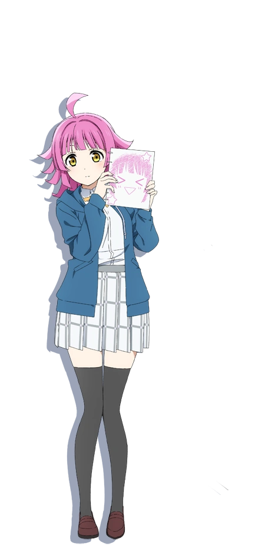
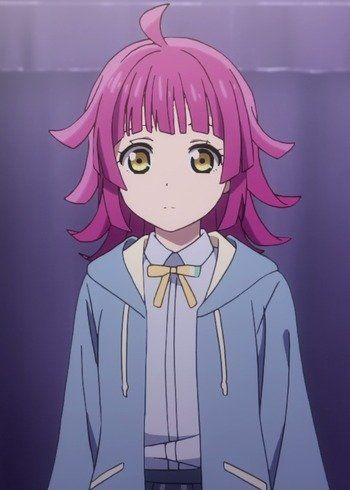

## R1N Project
Hello!! Introduce my AI Project _**["R1N"](https://github.com/Nomu1Nomu1/ai-personal-api)**_.

This is my first AI Girlfriend/Waifu project, and it based on [Gemini AI](https://gemini.google.com/). I have motivation to beat [Grok AI](https://grok.com/)

#### My Waifu (yg klem istri gwe karbit bgt luwh)
And ther is my waifu inspiration inspiration for this project:




### Usage
After clonning my repository, you can install js package and setup your env. I already set env example on [this](https://github.com/Nomu1Nomu1/ai-personal-api/blob/main/.env.example).

And you can get Gemini AI from [Google AI Studio](https://aistudio.google.com/)

### Sir, after you're done set up... you can do this to my API

Postman (raw body json) 

***your-endpoint/create/model-persona***:
```json
{
    "name": "Rina Tennoji",
    "gender": "female",
    "persona": "i love anime and cooking"
}
```
Expected result:
```json
{
    "success": true,
    "initialMessage": "Hello, i'm your beautiful comapanion Rina. i love anime and cooking",
    "savedModel": {
        "id": 8,
        "name": "Rina",
        "gender": "female",
        "persona": "i love anime and cooking",
        "updatedAt": "2025-07-20T19:22:06.795Z",
        "createdAt": "2025-07-20T19:22:06.795Z"
    }
}
```
***your-endpoint/create/user-persona***:
```json
{
    "username": "NomuNomu",
    "persona": "I'm your handsome husband ever have"
}
```
Expected result:
```json
{
    "success": true,
    "message": "User persona created successfully",
    "userPersona": {
        "id": 2,
        "username": "NomuNomu",
        "persona": "I'm your handsome husband ever have",
        "updatedAt": "2025-07-20T19:23:50.937Z",
        "createdAt": "2025-07-20T19:23:50.937Z"
    }
}
```

That endpoint is for create your model and your persona. It will saved on your database.

#### Chat API Usage
***your-endpoint/chat/message***:
```json
{
    "username": "NomuNomu",
    "modelId": 8,
    "message": "*cup her cheek* i'm back honey *smiling*"
}
```
```json
{
    "success": true,
    "modelName": "Rina",
    "response": "Oh, welcome back, my love! *My eyes light up as I lean into your hand, a warm smile gracing my lips.* I've missed you so much today! How was your day, darling? Come, let's get you comfortable."
}
```